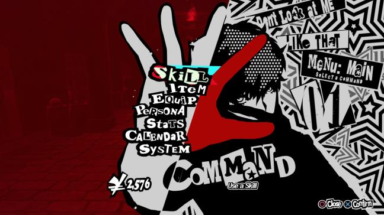
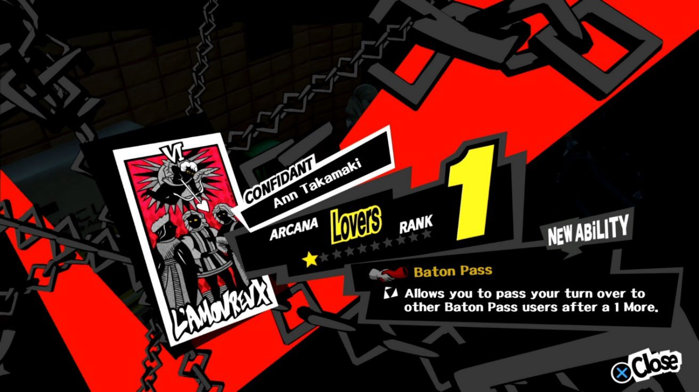

# Persona 5 · referencia de UI para Paric.io

Referencia aportada por Oscar el **11 de septiembre de 2026**: [Persona 5 en Game UI Database, ficha 72](https://www.gameuidatabase.com/gameData.php?id=72).

Se guarda como inspiración para crear y mejorar la UI del portfolio. Complementa [DESIGN.md](../DESIGN.md), [DESIGN-SPECS.md](../DESIGN-SPECS.md) y los prototipos existentes; las decisiones del proyecto siguen prevaleciendo.

## Alcance y material conservado

La ficha original devolvió una comprobación de Cloudflare y el navegador de consulta no pudo acceder a la galería. No se ha archivado la web completa ni revisado todas sus pantallas o animaciones. El análisis visual se apoya en dos capturas de esa misma ficha reproducidas en la publicación de Martin, Cooper y Kavakli, *Review of Core Graphic Design Principles Used in Computer Games* (VISUAL 2022). Su bibliografía identifica expresamente la ficha 72 y las dos imágenes.

Se conservan los JPEG incrustados en esas publicaciones, sin redibujarlos. Son reproducciones para consulta, con la resolución disponible en cada documento; no son descargas de los originales de la galería. La UI y las ilustraciones corresponden a Persona 5, P-Studio / Atlus. Estos archivos permanecen en `references/assets/`, como material de estudio.

| Pantalla | Enlace de la ficha citado por la publicación | Copia local y procedencia |
|---|---|---|
| Menú principal, «COMMAND» | [Player Menus, pid=46](https://www.gameuidatabase.com/gameData.php?id=72#&gid=1&pid=46) | [Menú, 648 × 364](assets/persona5-gameui-menu.jpg), figura 13 de la [publicación, página 6 del PDF](https://www.thinkmind.org/articles/visual_2022_1_20_70008.pdf#page=6) |
| Confidente, rango y nueva habilidad | [Entrada citada como «Modal: Item Get», pid=25](https://www.gameuidatabase.com/gameData.php?id=72#&gid=1&pid=25) | [Confidente, 1312 × 738](assets/persona5-gameui-confidant.jpg), [presentación, diapositiva 24](https://www.iaria.org/conferences2022/filesVISUAL22/VISUAL_70008.pdf#page=24); también figura 14 de la publicación |

Los enlaces con `pid` se conservan tal como aparecen en la bibliografía; no se ha comprobado que la galería actual mantenga ese orden. La segunda captura muestra a Ann Takamaki, rango 1 y una habilidad nueva, aunque la bibliografía la denomine «Modal: Item Get».

## Lectura de las capturas

**Menú.** Retrato, lista y titular forman una composición asimétrica. El fondo rojo de la izquierda compensa la trama de la derecha. Las opciones comparten un eje reconocible pese al lettering irregular; «Skill» lleva una placa de selección. «COMMAND» domina sobre la ayuda inferior y los controles quedan en una esquina. La jerarquía depende de escala, silueta y contraste. [Fuente visual: figura 13](https://www.thinkmind.org/articles/visual_2022_1_20_70008.pdf#page=6).

**Confidente.** Una diagonal roja conecta carta, identidad y rango. El número concentra la atención; la descripción ocupa una placa negra más horizontal. Los bordes quebrados separan información del fondo y el cierre se reconoce abajo a la derecha. Hay amarillo en el rango y cian en controles; la referencia no se limita estrictamente a tres colores. [Fuente visual: diapositiva 24](https://www.iaria.org/conferences2022/filesVISUAL22/VISUAL_70008.pdf#page=24).

## Aplicaciones propuestas para el portfolio

Estas son interpretaciones de diseño para futuras iteraciones, no defectos comprobados mediante una revisión visual de la web actual ni cambios ya implementados.

| Zona del proyecto | Aplicación de la referencia |
|---|---|
| Menú global (`GlobalMenu`) | Dar prioridad a la opción activa y mantener lista, cartel y contexto como una composición conjunta. Ajustar su relación de tamaño y posición antes de sumar decoración. La placa seleccionada debe seguir siendo reconocible por su forma y contraste. |
| Inicio (`HomeHero`) | Ordenar la lectura entre nombre, rol y acción principal. Usar el plano diagonal para dirigir la mirada hacia ese conjunto. Reservar aire para que las letras recortadas conserven una silueta clara. |
| Galería (`ProjectCarouselCard`, `P5Card`) | Reforzar la diferencia entre proyecto activo y vecinos mediante los recursos existentes: tamaño, posición, borde y cuña. El título y la captura del proyecto deben tener más peso que año, contador y etiquetas. |
| Detalle de proyecto | Componer captura, título y datos como grupos relacionados, siguiendo la relación carta–identidad–dato destacado del panel de confidente. Mantener reto y solución en zonas de lectura estable, sin trasladar la inclinación del marco al párrafo. |
| Controles y ayuda (`P5Kbd`, navegación) | Agrupar las acciones secundarias en una zona predecible. En móvil, conservar controles táctiles y reordenar el contenido; la composición horizontal del juego es una referencia de jerarquía, no una maqueta que deba encogerse entera. |

La primera oportunidad a explorar es el **menú global**; después, la jerarquía de las **fichas de proyecto**. Ambos tienen un equivalente visual directo en las capturas guardadas. Para concretar una mejora bastará comparar la vista correspondiente con estas imágenes y los prototipos del proyecto.

## Criterio al reutilizarla

- Mantener las familias, colores y geometrías ya definidos en [los tokens del proyecto](../app/assets/css/). El amarillo y el cian del juego no amplían la paleta autorizada de Paric.io. Se conserva la [decisión de contraste](../docs/adr/001-contraste.md).
- Construir con las piezas existentes: `P5Heading`, `P5NavItem`, `P5Stamp`, `P5Card` y `P5FactCard`. Adaptar relaciones de escala, composición y énfasis; emplear contenido e imágenes propios del portfolio.
- Reservar la distorsión más expresiva para titulares, placas y marcos. La explicación del trabajo necesita una lectura cómoda en castellano e inglés.
- Estas imágenes estáticas no permiten deducir duraciones, secuencias, comportamiento al pasar el ratón ni navegación por teclado. El movimiento sigue lo definido en el proyecto; cualquier estudio de animación del juego requerirá una referencia en vídeo.
- Conservar foco visible, navegación por teclado, controles táctiles y movimiento reducido al aplicar las ideas. El panel de recompensa no justifica añadir confirmaciones ficticias al contacto ni métricas inventadas a los proyectos.
